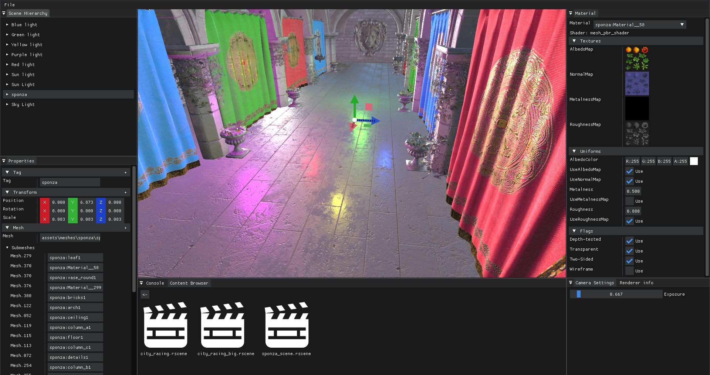
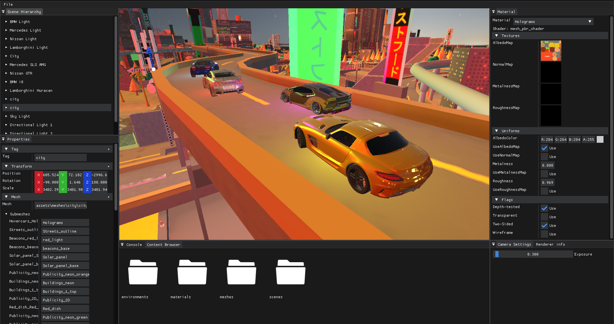
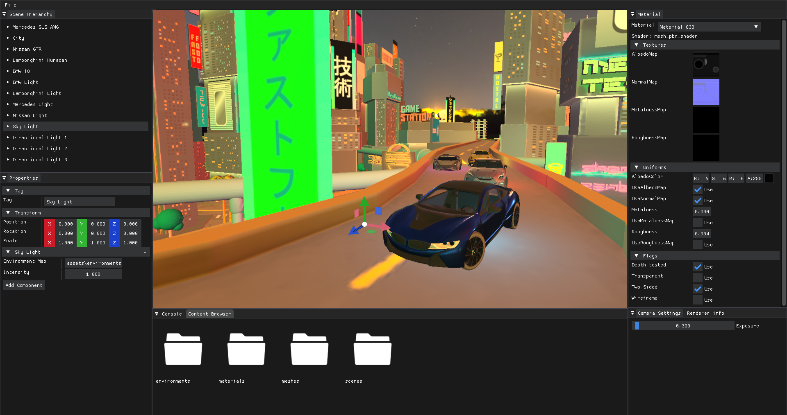

# Game-Engine/Rusty-Engine

Game engine project for FMI Rust Programming course. The engine uses DirectX 11 for rendering as well as Win32 API for its other systems, making it support Windows OS only.
Currently implemented features:
- Input and event systems
- Window system
- Model loading (currently FBX format only)
- PBR materials
- Image based lighting and HDR environment maps
- Scene system
- Level editor

## Screenshots

